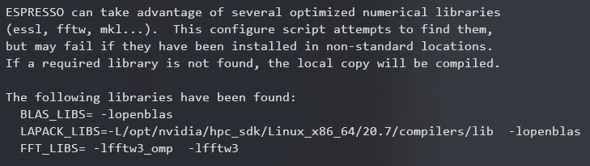

# qe-compile

[Back to home](/readme.md)

**Table of content**
1. [qe-compile](#qe-compile)
2. [背景](#背景)
3. [编译方法](#编译方法)
   1. [Nvidia HPC SDK 和 cuda toolkit 的安装](#nvidia-hpc-sdk-和-cuda-toolkit-的安装)
   2. [编译QE](#编译qe)
      1. [QE6.7](#qe67)
      2. [QE6.8](#qe68)
      3. [QE7.0](#qe70)

# 背景

# 编译方法

## Nvidia HPC SDK 和 cuda toolkit 的安装

首先，安装Nvidia HPC SDK：

```shell
# 安装基础编译链
sudo apt install build-essential

# 解压 Nvidida-HPC-SDK
tar -xvzf nvhpc_2020_207_Linux_x86_64_cuda_multi.tar.gz
cd nvhpc_2020_207_Linux_x86_64_cuda_multi/

# 安装
sudo ./install # 默认安装在/opt/nvidia/hpc_sdk，需要管理员权限
# Please choose install option:
enter 1  for Single system install
enter
# Note: directory /opt/nvidia/hpc_sdk was created.
# Installing NVIDIA HPC SDK version 20.7 into /opt/nvidia/hpc_sdk
# No selection/hitting enter will choose CUDA 11.0
```

将HPC SDK的路径写入环境变量：

```shell

# Nvidia hpc sdk
NVARCH=`uname -s`_`uname -m`; export NVARCH
NVCOMPILERS=/opt/nvidia/hpc_sdk; export NVCOMPILERS
MANPATH=$MANPATH:$NVCOMPILERS/$NVARCH/20.7/compilers/man; export MANPATH
PATH=$NVCOMPILERS/$NVARCH/20.7/compilers/bin:$PATH; export PATH
export PATH=$NVCOMPILERS/$NVARCH/20.7/comm_libs/mpi/bin:$PATH
export MANPATH=$MANPATH:$NVCOMPILERS/$NVARCH/20.7/comm_libs/mpi/man
export LD_LIBRARY_PATH=/opt/nvidia/hpc_sdk/Linux_x86_64/20.7/compilers/lib

export LD_LIBRARY_PATH=/usr/lib/wsl/lib2/:$LD_LIBRARY_PATH
export LIBRARY_PATH=/usr/lib/wsl/lib2/:$LIBRARY_PATH

```

安装cuda toolkit：

```shell
# 安装cuda-toolkit
apt-key adv --fetch-keys http://developer.download.nvidia.cn/compute/cuda/repos/ubuntu2004/x86_64/7fa2af80.pub
sudo sh -c 'echo "deb http://developer.download.nvidia.cn/compute/cuda/repos/ubuntu2004/x86_64 /" > /etc/apt/sources.list.d/cuda.list'
sudo apt-get update

sudo apt-get install -y cuda-toolkit-11-0
```

将cuda写入环境变量：

```shell

#cuda
export CUDA_HOME=/usr/local/cuda-11.0
export PATH=/usr/local/cuda-11.0/bin:$PATH
export LD_LIBRARY_PATH=/usr/local/cuda-11.0/lib64:$LD_LIBRARY_PATH

# wsl library
export LD_LIBRARY_PATH=/usr/lib/wsl/lib2/:$LD_LIBRARY_PATH
export LIBRARY_PATH=/usr/lib/wsl/lib2/:$LIBRARY_PATH

```

## 编译QE

### QE6.7

**更新windows11后重新编译6.7失败**

```shell

# 下载gpu版本的QE6.7
wget https://gitlab.com/QEF/q-e-gpu/-/archive/qe-gpu-6.7/q-e-gpu-qe-gpu-6.7.tar.gz

# 解压
tar -xvzf q-e-gpu-qe-gpu-6.7.tar.gz
rm q-e-gpu-qe-gpu-6.7.tar.gz

# 编译
cd q-e-gpu-qe-gpu-6.7/

./configure --with-cuda=/opt/nvidia/hpc_sdk/Linux_x86_64/20.7/cuda/11.0 --with-cuda-cc=35 --with-cuda-runtime=11.0 --enable-openmp --with-scalapack=yes --enable-parallel FC=nvfortran F90=nvfortran F77=nvfortran CC=nvcc CXX=nvc++

export PATH=/opt/nvidia/hpc_sdk/Linux_x86_64/20.7/cuda/11.0/bin:$PATH
export LD_LIBRARY_PATH=/opt/nvidia/hpc_sdk/Linux_x86_64/20.7/cuda/11.0/lib64:$LD_LIBRARY_PATH

# 解决libcuda找不到的问题(错误：/usr/lib/wsl/lib/libcuda.so.1 is not a symbolic link)
sudo cp /usr/lib/wsl/lib /usr/lib/wsl/lib2 
export LD_LIBRARY_PATH=/usr/lib/wsl/lib2/:$LD_LIBRARY_PATH
export LIBRARY_PATH=/usr/lib/wsl/lib2/:$LIBRARY_PATH

# https://zhuanlan.zhihu.com/p/283043907

```

### QE6.8

**Windows 11中编译顺畅**

```shell

./configure --with-cuda=/opt/nvidia/hpc_sdk/Linux_x86_64/20.7/cuda/11.0 --with-cuda-cc=35 --with-cuda-runtime=11.0 --enable-openmp --with-scalapack=no --enable-parallel FC=nvfortran F90=nvfortran F77=nvfortran CC=nvcc CXX=nvc++ --enable-openacc

make pw -j 8
make cp -j 8
make pp -j 8
make hp -j 8
```

### QE7.0

**QE7.0 的新特性**

- GPU support for PWscf and CP significantly extended
- RMM-DIIS for CPU (S. Nisihara) and GPU (E. de Paoli, P. Delugas)
- DFT-D3: MPI parallelization and GPU acceleration with OpenACC
- projwfc.x can be used to compute the PDOS in a local basis (I. Timrov)
- Charge self-consistent DFT+DMFT calculations with the TRIQS software package
- via Wannier90 (S. Beck, CCQ Flatiron Institute)

```bash
# 下载源码包
wget https://github.com/QEF/q-e/releases/download/qe-7.0/qe-7.0-ReleasePack.tgz
# 解压
tar -xvzf qe-7.0-ReleasePack.tgz
cd qe-7.0/
# 链接库
./configure --with-cuda=/opt/nvidia/hpc_sdk/Linux_x86_64/20.7/cuda/11.0 --with-cuda-cc=35 --with-cuda-runtime=11.0 --with-scalapack=no --enable-openacc
# 编译
make pw
make pp -j
make cp -j
```

编译中使用的库：


